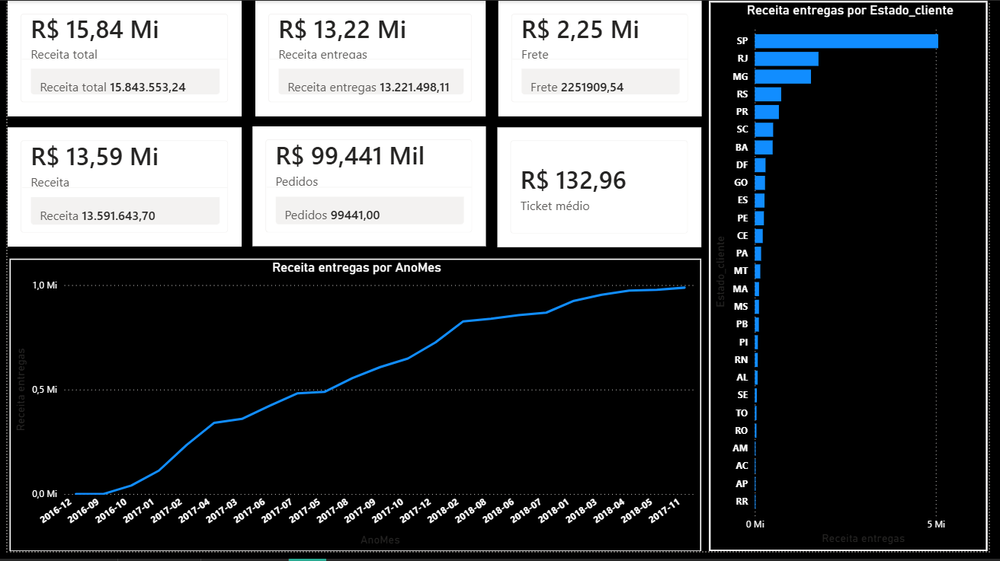
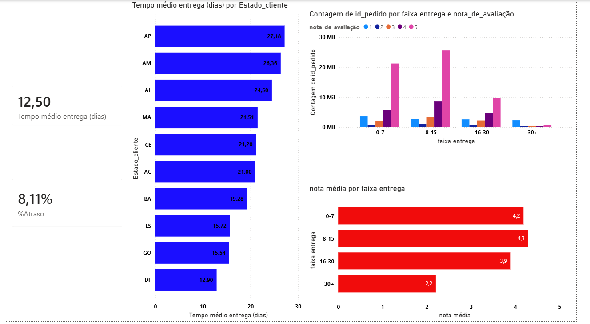
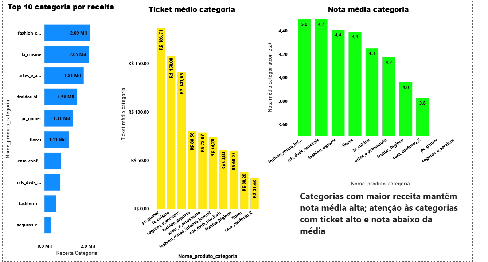

# Análise de E-commerce | Power BI + Python

## Objetivo do Projeto

Este projeto tem como objetivo realizar uma análise completa de um e-commerce brasileiro, explorando indicadores financeiros, logísticos e de satisfação do cliente.

O foco foi responder perguntas estratégicas como:

- Quais estados geram mais receita?
- Qual o ticket médio por categoria?
- O atraso na entrega impacta a nota do cliente?
- Categorias com maior receita mantêm boa avaliação?
- Existem categorias com ticket alto e nota baixa (risco)?

---

##  Ferramentas Utilizadas

- Python (Pandas) para tratamento e preparação dos dados
- Power BI para modelagem e visualização
- Git & GitHub para versionamento
- DAX para criação de métricas

---

##  Estrutura do Projeto

- `Dashboard.pbix` → Arquivo principal do Power BI
- `README.md` → Documentação do projeto

---

##  Principais Indicadores

### Financeiro
- Receita Total
- Receita por Estado
- Receita por Categoria
- Ticket Médio

###  Logística
- Tempo médio de entrega
- Percentual de atraso
- Impacto do atraso na avaliação

###  Satisfação
- Nota média por categoria
- Relação entre tempo de entrega e avaliação
- Distribuição de notas por faixa de entrega

---

##  Principais Insights

- Estados do Sudeste concentram maior receita.
- Existe correlação negativa entre tempo de entrega e nota do cliente.
- Categorias com maior receita mantêm nota média acima de 4.
- Algumas categorias apresentam ticket alto com nota abaixo da média, indicando possível risco estratégico.

---

## Conclusão

A análise mostra que desempenho logístico impacta diretamente a percepção do cliente.  
O monitoramento contínuo de atraso e satisfação é essencial para manter crescimento sustentável.

---

##  Sobre mim

Sou estudante de Análise de Dados e busco oportunidades de estágio/júnior na área.  
Este projeto demonstra minha capacidade de:

- Modelagem de dados
- Construção de métricas em DAX
- Análise exploratória
- Construção de dashboards estratégicos

## Python (EDA e Tratamento)

- Notebook: [`notebooks/analise_exploratoria.ipynb`](notebooks/analise_exploratoria.ipynb)
- Saída gerada: `dados/processed/base_logistica.csv`

### Insights (Python)
- Correlação tempo de entrega x nota: **-0,35**
- Nota média sem atraso: **4,29**
- Nota média com atraso: **2,56**
- Nota 1⭐: **~20,5 dias** vs Nota 5⭐: **~10,2 dias**

## Dashboard

### Visão Geral (Financeiro)

### Logística & Satisfação

### Análise por Categoria

